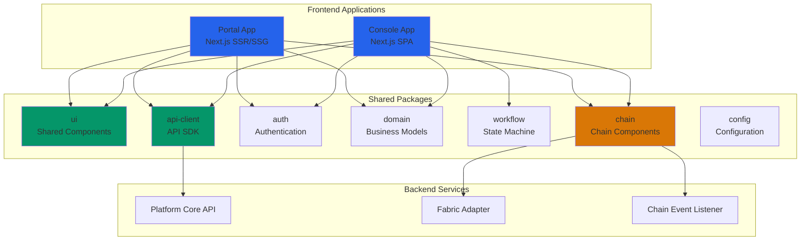
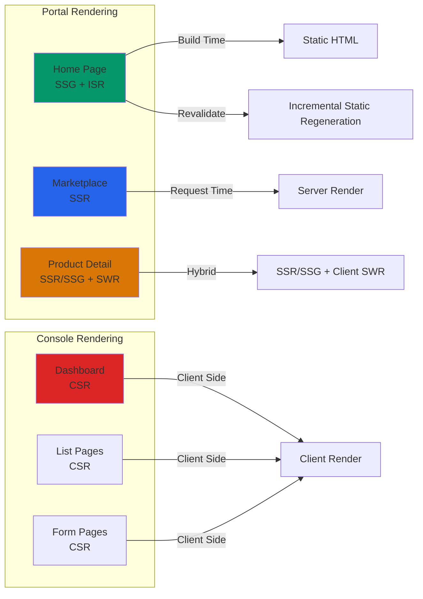
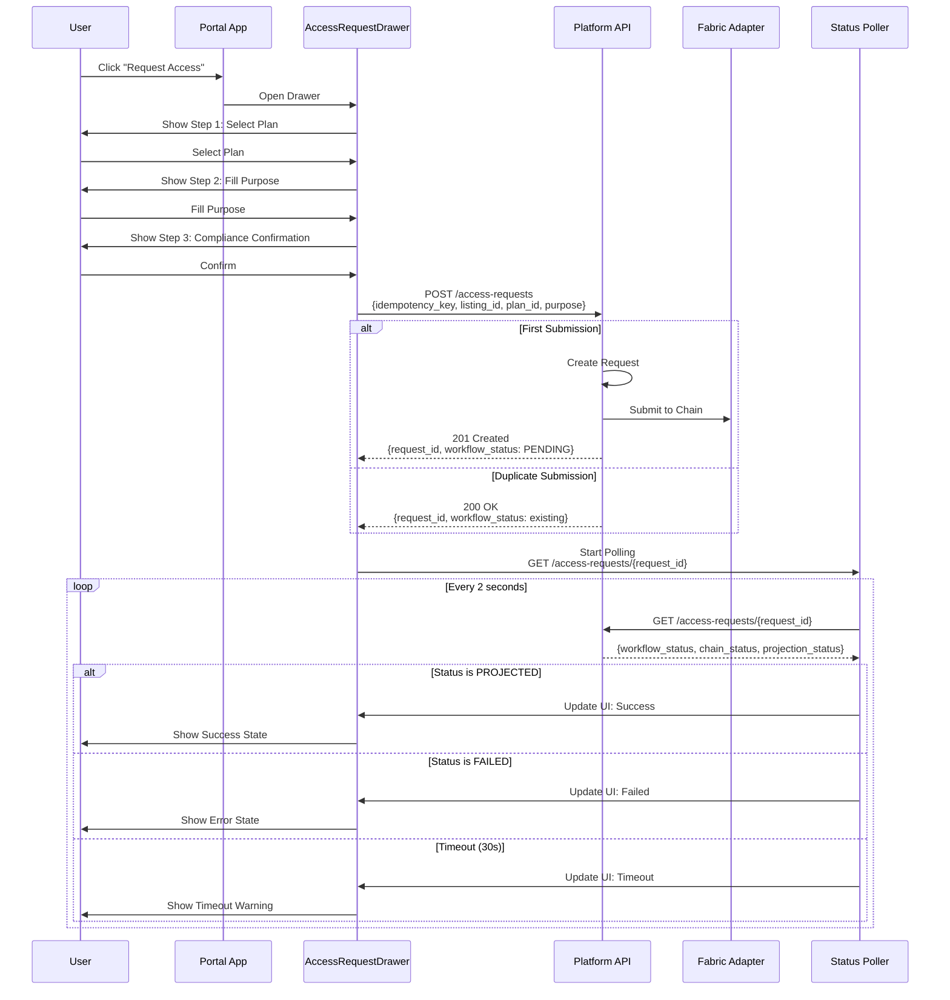

# Design Document: Data Trading Platform Frontend

## Overview

数据交易平台前端系统是一个企业级 Web 应用，采用 Monorepo 架构，包含两个主要应用：Portal（公开门户）和 Console（工作台）。系统基于 Next.js 14+ 和 React 19 构建，使用 TypeScript 提供类型安全，通过 pnpm workspace 和 Turborepo 管理多包依赖。

Portal 应用采用 SSR/SSG 策略优化 SEO 和首屏性能，提供数据市场浏览、商品详情查看和访问申请功能。Console 应用是 SPA 架构，为买家、供应商和平台运营提供专业工作台，支持商品管理、订单处理、审批流程和数据分析。

系统核心特性包括：链上可信凭证展示、URL 驱动的状态管理、幂等提交机制、RBAC 权限控制和实时状态同步。UI 设计遵循金融科技风格，采用深邃蓝色主题，强调数据可信和专业性。

## Architecture

### System Architecture



### Monorepo Structure

```
data-trading-frontend/
├── apps/
│   ├── portal/                    # Next.js 门户应用
│   │   ├── src/
│   │   │   ├── app/              # App Router 路由
│   │   │   ├── components/       # 页面组件
│   │   │   ├── lib/              # 工具函数
│   │   │   └── styles/           # 全局样式
│   │   ├── public/               # 静态资源
│   │   ├── next.config.ts
│   │   ├── tailwind.config.ts
│   │   └── package.json
│   │
│   └── console/                   # Next.js 工作台应用
│       ├── src/
│       │   ├── app/              # App Router 路由
│       │   ├── components/       # 页面组件
│       │   ├── lib/              # 工具函数
│       │   └── styles/           # 全局样式
│       ├── public/               # 静态资源
│       ├── next.config.ts
│       ├── tailwind.config.ts
│       └── package.json
│
├── packages/
│   ├── ui/                        # 共享 UI 组件库
│   │   ├── src/
│   │   │   ├── components/       # 基础组件
│   │   │   ├── hooks/            # 自定义 Hooks
│   │   │   └── utils/            # 工具函数
│   │   ├── tailwind.config.ts
│   │   └── package.json
│   │
│   ├── api-client/                # API SDK
│   │   ├── src/
│   │   │   ├── client.ts         # HTTP 客户端
│   │   │   ├── endpoints/        # API 端点
│   │   │   └── types.ts          # API 类型
│   │   └── package.json
│   │
│   ├── auth/                      # 认证权限
│   │   ├── src/
│   │   │   ├── provider.tsx      # Auth Provider
│   │   │   ├── hooks.ts          # Auth Hooks
│   │   │   └── rbac.ts           # RBAC 逻辑
│   │   └── package.json
│   │
│   ├── domain/                    # 业务模型
│   │   ├── src/
│   │   │   ├── models/           # 领域模型
│   │   │   ├── schemas/          # Zod Schemas
│   │   │   └── constants.ts      # 常量定义
│   │   └── package.json
│   │
│   ├── workflow/                  # 状态机组件
│   │   ├── src/
│   │   │   ├── machines/         # XState 状态机
│   │   │   └── components/       # 流程组件
│   │   └── package.json
│   │
│   ├── chain/                     # 链相关组件
│   │   ├── src/
│   │   │   ├── components/       # ChainProofCard 等
│   │   │   ├── hooks/            # 链状态 Hooks
│   │   │   └── utils.ts          # 链工具函数
│   │   └── package.json
│   │
│   └── config/                    # 配置
│       ├── eslint-config/
│       ├── typescript-config/
│       └── tailwind-config/
│
├── turbo.json                     # Turborepo 配置
├── pnpm-workspace.yaml            # pnpm workspace 配置
└── package.json                   # 根 package.json
```

### Rendering Strategy



## Main Algorithm/Workflow

### Access Request Flow



### URL-Driven State Management Flow

```mermaid
sequenceDiagram
    participant User as User
    participant Browser as Browser
    participant Marketplace as Marketplace Page
    participant URLState as URL State Manager
    participant API as Platform API
    
    User->>Marketplace: Visit /marketplace
    Marketplace->>URLState: Parse URL params
    URLState->>Marketplace: Extract filters {industry, dataType, priceModel}
    Marketplace->>API: GET /listings?filters=...
    API-->>Marketplace: Return filtered listings
    Marketplace->>Browser: Render results
    
    User->>Marketplace: Select filter: industry=finance
    Marketplace->>URLState: Update URL
    URLState->>Browser: Push state: /marketplace?industry=finance
    Marketplace->>API: GET /listings?industry=finance
    API-->>Marketplace: Return filtered listings
    Marketplace->>Browser: Re-render results
    
    User->>Browser: Refresh page
    Browser->>Marketplace: Load /marketplace?industry=finance
    Marketplace->>URLState: Parse URL params
    URLState->>Marketplace: Extract filters {industry: finance}
    Marketplace->>API: GET /listings?industry=finance
    API-->>Marketplace: Return filtered listings
    Marketplace->>Browser: Render results (state preserved)
    
    User->>Marketplace: Copy URL
    User->>User: Share URL with colleague
    User->>Browser: Colleague opens URL
    Browser->>Marketplace: Load /marketplace?industry=finance
    Marketplace->>URLState: Parse URL params
    Marketplace->>API: GET /listings?industry=finance
    API-->>Marketplace: Return filtered listings
    Marketplace->>Browser: Render same results (shareable state)
