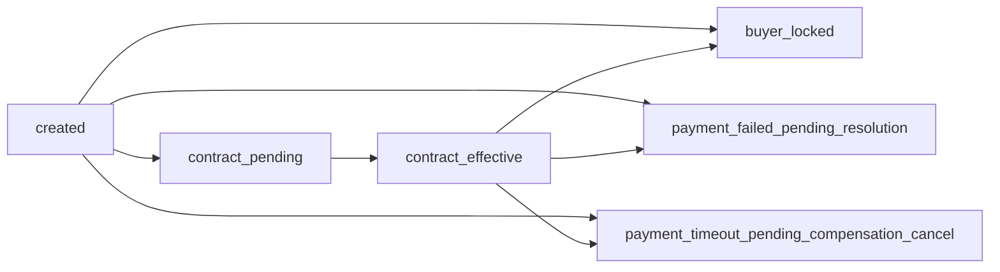
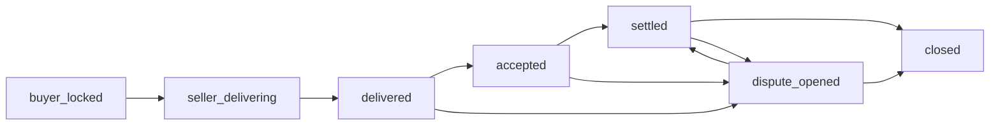

# Order Orchestration（TRADE-033）

本文件冻结 `V1-Core` 主交易链路的订单编排口径，明确以下内容：

- `trade.order_main.status` 主状态的唯一性
- `payment_status / delivery_status / acceptance_status / settlement_status / dispute_status` 五个子状态的职责
- 支付、合同、交付、验收、结算、争议之间的推进关系
- 互斥关系与禁止回退规则
- 支付 webhook 乱序保护与订单级 compare-and-swap 防护

## 1. 范围与边界

本文件只描述当前 V1 已落地实现的编排规则，不扩展 V2/V3 正式能力。

编排职责当前分布如下：

- `order`：订单主状态、子状态、SKU 专属 transition、交付门禁与最小交付记录
- `contract`：合同确认、签章 provider 占位、数字合同聚合
- `authorization`：授权发放、自动断权、生命周期快照
- `billing`：支付意图、支付 webhook、乱序保护、支付结果入单
- `delivery`：当前仅以 `delivery.delivery_record` 作为最小交付载体；具体交付模块目录仍是占位，首个交付/开通动作由 `order` 仓储层先创建或复用 `prepared` 记录

## 2. 冻结来源与实现锚点

冻结文档：

- `docs/领域模型/全量领域模型与对象关系说明.md`（4.4 交易与订单聚合）
- `docs/全集成文档/数据交易平台-全集成基线-V1.md`（15. 核心交易链路设计）
- `docs/业务流程/业务流程图-V1-完整版.md`（4.3 买方搜索、选购与下单流程）

核心实现锚点：

- `apps/platform-core/src/modules/order/domain/layered_status.rs`
- `apps/platform-core/src/modules/order/domain/payment_state.rs`
- `apps/platform-core/src/modules/order/application/mod.rs`
- `apps/platform-core/src/modules/order/repo/order_deliverability_repository.rs`
- `apps/platform-core/src/modules/billing/handlers.rs`
- `docs/05-test-cases/order-state-machine.md`

## 3. 状态模型

### 3.1 主状态是唯一真值

`trade.order_main.status` 是订单推进的唯一主状态。

以下字段是主状态的镜像子状态，不替代主状态：

| 字段 | 含义 | 当前主要写入方 |
| --- | --- | --- |
| `payment_status` | 支付结果与锁资结果 | `billing` webhook、SKU transition、退款/争议分支 |
| `delivery_status` | 是否待交付、交付中、已交付、阻断、关闭 | `layered_status` 基线推导 + SKU 仓储专属覆写 |
| `acceptance_status` | 是否未开始、待验收、已验收、争议中、关闭 | `layered_status` 基线推导 + SKU 仓储专属覆写 |
| `settlement_status` | 是否未开始、待结算、已结算、阻断、退款、关闭 | `layered_status` 基线推导 + SKU 仓储专属覆写 |
| `dispute_status` | 是否无争议、开启、解决 | `layered_status` 基线推导 + 争议分支覆写 |

### 3.2 主状态基线分层

对未定义 SKU 专属覆写的状态，统一走 `derive_layered_status(...)`：

| 主状态 | `delivery_status` | `acceptance_status` | `settlement_status` | `dispute_status` |
| --- | --- | --- | --- | --- |
| `created` | `pending_delivery` | `not_started` | `not_started` | `none` |
| `contract_pending` | `pending_delivery` | `not_started` | `not_started` | `none` |
| `contract_effective` | `pending_delivery` | `not_started` | `not_started` | `none` |
| `buyer_locked` | `pending_delivery` | `not_started` | `paid -> pending_settlement`，否则 `not_started` | `none` |
| `seller_delivering` | `in_progress` | `not_started` | `paid -> pending_settlement`，否则 `not_started` | `none` |
| `delivered` | `delivered` | `pending_acceptance` | `paid -> pending_settlement`，否则 `not_started` | `none` |
| `accepted` | `delivered` | `accepted` | `paid -> pending_settlement`，否则 `not_started` | `none` |
| `settled` | `delivered` | `accepted` | `settled` | `none` |
| `closed` | `closed` | `closed` | `closed` | `none` |
| `payment_failed_pending_resolution` | `pending_delivery` | `not_started` | `not_started` | `none` |
| `payment_timeout_pending_compensation_cancel` | `pending_delivery` | `not_started` | `not_started` | `none` |

若关闭原因是 `order_cancel_*`，则 `derive_closed_layered_status_by_reason(...)` 会把交付、验收、结算统一映射为 `canceled`。

### 3.3 SKU 专属覆写

标准 SKU 会在专属仓储里对基线分层做定向覆写，典型例子：

- `FILE_STD` / `FILE_SUB`：`dispute_opened` 时写入 `acceptance_status=disputed`、`settlement_status=blocked`、`dispute_status=open`
- `SHARE_RO`：`interrupt_dispute` 时写入 `delivery_status=blocked`、`acceptance_status=blocked`、`settlement_status=frozen`、`dispute_status=opened`
- `API_SUB`：`active` 时把 `acceptance_status` 固定为 `accepted`
- `API_PPU` / `SBX_STD` / `SHARE_RO`：到期或禁用时写入 `expired / closed` 等专属子状态
- `RPT_STD`：`report_generated` 阶段把 `acceptance_status` 标记为 `in_progress`

因此：

- 主状态字段负责表达“订单在链路中的位置”
- 子状态字段负责表达“支付/交付/验收/结算/争议是否已经推进到位”
- 任何一个 SKU 的专属覆写都不能绕过主状态唯一性

## 4. 编排阶段

### 4.1 订单创建与合同

主链路从 `created` 开始。

当前阶段的关键动作：

- 下单：`trade.order.create`
- 合同确认：`trade.contract.confirm`

推进关系：

说明：

- `created -> buyer_locked` 与 `contract_effective -> buyer_locked` 是当前支付成功可推进的两条合法入口。
- `approval_pending`、`contract_pending` 等前序状态不会被支付结果直接推进。

### 4.2 支付与锁资

支付结果由 `billing` 的 webhook 入口落到订单：

1. 幂等/签名/重放窗口检查
2. 更新 `payment.payment_intent`
3. 调用 `apply_payment_result_to_order(...)`

支付结果到订单的固定映射：

| 当前主状态 | 支付结果 | 目标主状态 | 目标 `payment_status` | 备注 |
| --- | --- | --- | --- | --- |
| `created` / `contract_effective` | `Succeeded` | `buyer_locked` | `paid` | 同时补写 `buyer_locked_at` |
| `created` / `contract_effective` | `Failed` | `payment_failed_pending_resolution` | `failed` | 不进入交付 |
| `created` / `contract_effective` | `TimedOut` | `payment_timeout_pending_compensation_cancel` | `expired` | 不进入交付 |
| 其他任意更后状态 | 任意 | 忽略 | 保持原值 | 写 `order.payment.result.ignored` |

### 4.3 交付前门禁与最小交付记录

所有首个交付/开通动作前，统一经过 `ensure_order_deliverable_and_prepare_delivery(...)`。

门禁必须同时满足：

- `payment_status = paid`
- 买卖双方主体状态都是 `active`
- 主体未被风险策略阻断
- 商品状态是 `listed`
- 资产版本状态是 `active` 或 `published`
- SKU 状态是 `active` 或 `listed`
- 商品审核已通过
- 商品未被风控阻断
- 合同存在且 `status = signed`

门禁通过后会创建或复用：

- `delivery.delivery_record(status=prepared)`

并写入审计：

- `trade.order.delivery_gate.prepared`

首个交付/开通动作与最小交付载体映射：

| SKU | 首个动作 | 目标主状态 | `delivery_type` | `delivery_route` |
| --- | --- | --- | --- | --- |
| `FILE_STD` | `start_delivery` | `seller_delivering` | `file_download` | `signed_url` |
| `FILE_SUB` | `start_cycle_delivery` | `seller_delivering` | `revision_push` | `revision_event` |
| `API_SUB` | `bind_application` | `api_bound` | `api_access` | `api_gateway` |
| `API_PPU` | `authorize_access` | `api_authorized` | `api_access` | `api_gateway` |
| `SHARE_RO` | `enable_share` | `share_enabled` | `share_grant` | `share_link` |
| `QRY_LITE` | `authorize_template` | `template_authorized` | `template_grant` | `template_query` |
| `SBX_STD` | `enable_workspace` | `workspace_enabled` | `sandbox_workspace` | `sandbox_portal` |
| `RPT_STD` | `create_report_task` | `report_task_created` | `report_delivery` | `result_package` |

### 4.4 验收、结算与争议

典型后段链路：

说明：

- 文件类订单沿 `seller_delivering -> delivered -> accepted -> settled -> closed` 推进。
- API、共享、查询、沙箱、报告 SKU 会在 `buyer_locked` 之后走各自专属状态，但仍然回写同一组子状态字段。
- 争议分支会阻断验收或结算，不允许一边保持争议开启一边继续正常完结。

## 5. 互斥关系

以下约束是当前 V1 必须满足的互斥关系：

1. 一个订单任意时刻只能有一个主状态。
2. `payment_status != paid` 时，不允许进入首个交付/开通动作。
3. 合同未签署时，不允许进入首个交付/开通动作。
4. 已进入更后履约状态后，晚到支付回调不能把订单拉回 `buyer_locked`、失败态或超时态。
5. `closed`、`revoked`、`disabled`、`expired` 等终止态不能重新进入正常交付或计费动作。
6. 争议开启后，验收与结算必须进入阻断、冻结或争议态，不能继续按正常 happy path 推进。
7. 子状态必须服务于主状态，不允许出现“主状态仍在前序阶段，但子状态已表现为已交付/已结算”的倒挂。

## 6. 回调乱序保护

支付 webhook 的乱序保护分两层。

### 6.1 PaymentIntent 层保护

`billing/handlers.rs` 先保护 `payment.payment_intent`：

- 重复 webhook：`payment.webhook.duplicate`
- 签名拒绝：`payment.webhook.rejected_signature`
- 重放窗口拒绝：`payment.webhook.rejected_replay`
- 事件时间早于最近一次处理时间：`payment.webhook.out_of_order_ignored`
- 目标支付状态 rank 低于当前状态：`payment.webhook.out_of_order_ignored`

返回结果会带：

- `processed_status = out_of_order_ignored`
- `out_of_order_ignored = true`

### 6.2 Order 层保护

`apply_payment_result_to_order(...)` 再保护 `trade.order_main`：

- 只允许 `created` / `contract_effective` 接收支付结果推进
- 事务内 `SELECT ... FOR UPDATE`
- `UPDATE ... WHERE status = current_status`，防止并发覆盖
- 不可推进时写 `order.payment.result.ignored`
- 合法推进时写 `order.payment.result.applied`

因此 V1 的防护结论是：

- webhook 级乱序先阻断 `PaymentIntent` 回退
- 即使 webhook 已处理，订单层也不会让更后状态被旧结果覆盖

## 7. 审计与验证证据

本编排文档对应的关键审计动作：

- `trade.order.create`
- `trade.contract.confirm`
- `trade.order.delivery_gate.prepared`
- `trade.order.file_std.transition`
- `trade.authorization.grant`
- `trade.authorization.auto_cutoff.expired`
- `payment.webhook.processed`
- `payment.webhook.out_of_order_ignored`
- `order.payment.result.applied`
- `order.payment.result.ignored`

已存在的自动化与联调证据：

- `docs/05-test-cases/order-state-machine.md`
- `apps/platform-core/src/modules/order/tests/trade008_*` 到 `trade015_*`
- `apps/platform-core/src/modules/order/tests/trade024_illegal_state_regression_db.rs`
- `apps/platform-core/src/modules/order/tests/trade027_main_trade_flow_db.rs`
- `apps/platform-core/src/modules/order/tests/trade030_payment_result_orchestrator_db.rs`
- `apps/platform-core/src/modules/order/tests/trade031_deliverability_gate_db.rs`

## 8. 维护约束

- 若新增主状态，必须同时补：
  - 主状态到五个子状态的映射
  - 非法回退保护
  - 审计动作
  - `docs/05-test-cases/order-state-machine.md`
- 若新增 SKU transition，不允许绕过统一交付门禁或支付回退保护。
- 若后续把交付任务自动创建器从 `order` 仓储层迁出到独立 `delivery` 模块，必须同步修订本文件中的职责边界与最小交付记录说明。
